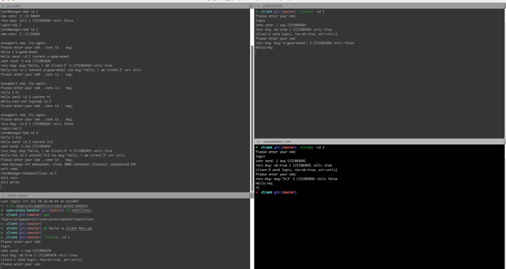

## 运行demo

先启动server
```
cd cmd/server
go run main.go
```


可以启动多个client,并指定id
```
cd cmd/server
go build -o client main.go
./client -id=x
```




### 消息约定
resquest => response 
request: 奇数
response=request+1 （偶数）